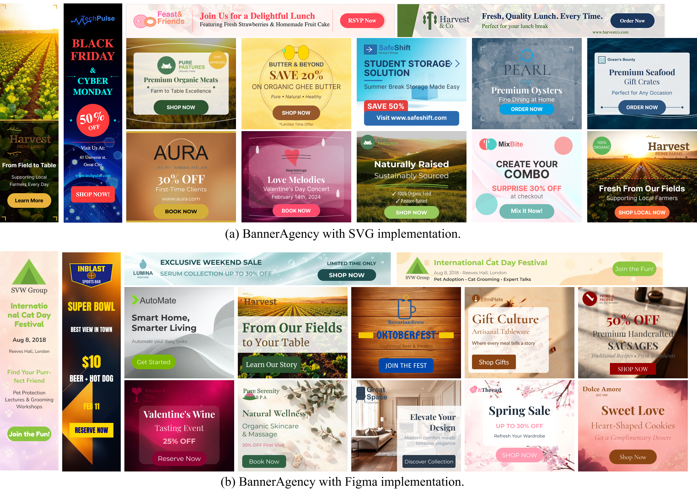
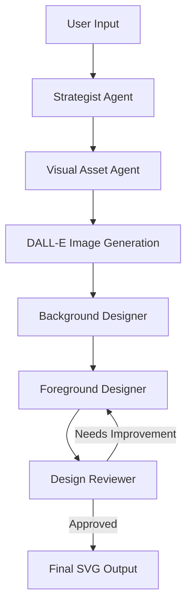

# BannerAgency: AI-Powered Banner Design System

Một hệ thống agent tự động cho việc tạo banner quảng cáo có thể chỉnh sửa được, được hỗ trợ bởi các mô hình ngôn ngữ đa phương thức (Multimodal LLMs).



<br>
<a href="https://arxiv.org/pdf/2503.11060"></a>
<a href="https://banneragency.github.io/"></a>

**BannerAgency: Advertising Banner Design with Multimodal LLM Agents**, EMNLP 2025 Main

Tác giả: [Heng Wang](https://scholar.google.com.au/citations?user=jPj4ViQAAAAJ&hl=en), [Yotaro Shimose](https://github.com/yotaro-shimose), và [Shingo Takamatsu](https://scholar.google.co.jp/citations?user=oCVG8wQAAAAJ&hl=en) từ Sony Group Corporation

## Cài đặt

```bash
# Tạo môi trường ảo Python 3.10
python3.10 -m venv venv
source venv/bin/activate  # Trên Windows: venv\Scripts\activate

# Cài đặt dependencies
pip install -r requirements.txt

# Cài đặt cairosvg để export SVG (tùy chọn)
pip install cairosvg
```

### Cấu hình API Keys

1. Sao chép file `.env.example` thành `.env`:
```bash
cp .env.example .env
```

2. Chỉnh sửa file `.env` và thêm API keys của bạn:
```env
OPENAI_API_KEY=your_openai_api_key_here
```

## Sử dụng cơ bản

### Tạo banner đơn giản

```python
from main import BannerAgent

# Khởi tạo agent với mô hình OpenAI
agent = BannerAgent(model_name="gpt-5-nano")

# Tạo banner
result = agent.create_banner(
    user_input=(
        "Design a banner for a discussion on the ethical issues surrounding artificial intelligence. "
        "The target audience is Tech Enthusiasts, and the goal is to encourage them to join the discussion. "
        'Please include the quote: "Welcome to the new era of AI".'
    ),
    logo_path="BannerRequest400/logos_png/001_ethicai.png",
    width=300,
    height=250,
    max_iterations=7,
    output_format="svg"  # hoặc "json"
)

# Lưu kết quả
with open("banner.svg", "w", encoding="utf-8") as f:
    f.write(result)
```

### Các tùy chọn cấu hình

```python
agent = BannerAgent(
    model_name="gpt-5-nano"  # hoặc các model OpenAI khác
)

result = agent.create_banner(
    user_input="Mô tả banner mong muốn",
    logo_path="path/to/logo.png",  # Tùy chọn
    width=1200,                    # Chiều rộng banner
    height=628,                    # Chiều cao banner  
    max_iterations=3,              # Số lần cải thiện tối đa
    output_format="svg"            # "svg" hoặc "json"
)
```

## Kiến trúc hệ thống

BannerAgency sử dụng kiến trúc multi-agent với 5 chuyên gia AI:

1. **🎯 Strategist Agent**: Phân tích yêu cầu và thiết lập hướng chiến lược
2. **🖼️ Visual Asset Agent**: Tạo prompt cho text-to-image generation
3. **🎨 Background Designer**: Thiết kế composition và background
4. **📝 Foreground Designer**: Thiết kế layout và typography
5. **🔍 Design Reviewer**: Đánh giá và cải thiện design

### Quy trình làm việc



## Dataset BannerRequest400

### Logo images
100 logo được tạo bán tự động với sự hỗ trợ của [Claude-3.5 Sonnet](https://www.anthropic.com/news/claude-3-5-sonnet). Chúng tôi kiểm tra thủ công nội dung để đảm bảo chất lượng. Dataset bao gồm:
- Format PNG được render (`BannerRequest400/logos_png`)  
- Format SVG gốc (`BannerRequest400/logos_svg`)

### Banner requests
Đi kèm với 100 logo là 400 yêu cầu banner trừu tượng (`BannerRequest400/abstract_400.jsonl`) với 4 cặp mục tiêu-mục đích khác nhau cho mỗi logo. Các yêu cầu được mở rộng thành 5200 yêu cầu cụ thể (`BannerRequest400/concrete_5k.jsonl`) qua 13 kích thước banner tiêu chuẩn.

## Đánh giá

```bash
python3 eval.py --logo_file <logo_path> --image_file <image_path> --banner_request <request_text>
```

## Các tính năng chính

- **🤖 Multi-Agent Architecture**: 5 AI agents chuyên biệt
- **🎨 Intelligent Design**: Tự động thiết kế layout và color palette
- **🖼️ Image Generation**: Tích hợp DALL-E 3 cho hero images
- **📐 Responsive Design**: Hỗ trợ nhiều kích thước banner
- **🔄 Iterative Refinement**: Tự động cải thiện design qua nhiều vòng
- **📤 Multiple Outputs**: Xuất SVG và JSON
- **🎯 Brand Consistency**: Phân tích logo để tạo color palette phù hợp

## Troubleshooting

### Lỗi thường gặp

1. **ModuleNotFoundError**: Đảm bảo đã activate venv và cài đặt requirements
```bash
source venv/bin/activate  # hoặc venv\Scripts\activate trên Windows
pip install -r requirements.txt
```

2. **OpenAI API Error**: Kiểm tra API key trong file `.env`

3. **CairoSVG Error**: Cài đặt cairosvg nếu muốn convert SVG sang PNG
```bash
pip install cairosvg
```
